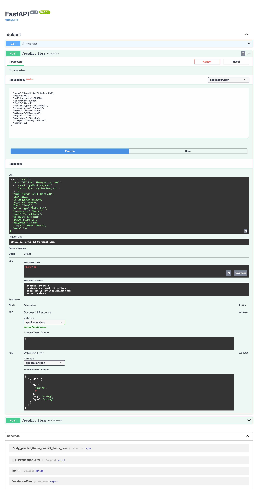
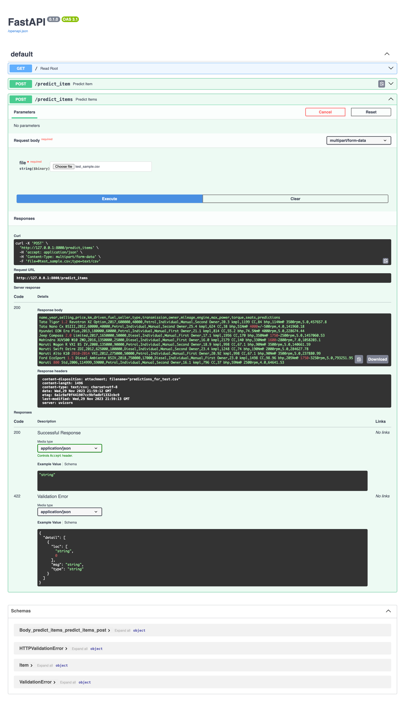

# Прогнозирование стоимости автомобилей и создание веб-сервиса для модели

Учебный проект по курсу ML, тема Линейные модели

## Описание задачи:
Проект посвящен прогнозированию стоимости автомобилей с использованием модели регрессии. В рамках работы был также разработан веб-сервис с использованием FastAPI для применения построенной модели на новых данных.

## Структура репозитория:
* `DP-HW1_Regression_with_inference.ipynb`: Jupyter Notebook для обучения модели регрессии. Включает в себя предобработку данных, обучение модели и оценку ее качества.
* `main.py`: Файл приложения FastAPI. Он определяет конечные точки API и включает функции для загрузки обученной модели и предобработки входных данных.
* `utils`: 'пакет' с одним скриптом, где содержится часть с препроцессингом данных
* `models`: папка содержит файлы обученной модели регрессии с лучшими метриками, скейлеры и преобразование категориальных признаков в .pkl формате.
* `test_sample.csv` и `predictions_for_test.csv`: исходный и конечный файл теста метода `predict_items`
* `test_row.json`: исходный файл для теста метода `predict_items`

## Что было сделано:
### **1. Исследование и предобработка данных**  
   * Подсчет основных характеристик 
   * Проверка на наличие пропусков, дубликатов
   * Заполнение пропуска медианой столбца и модой для `seats`
   * Извлечение числовых значений из строковых признаков `mileage`, `engine`, `max_power`
   * Разделение признака `torque` на `torque` и `max_torque_rpm` 

### **2. EDA**  
   * pairplot для общего исследования зависимостей в данных (трейна и теста) 
   * тепловая карта для определения корреляции между признаками и сравнения зависимостей с целевой переменной
   * scatterplot для наиболее скореллированных признаков
   * boxplot для просмотра выбросов в данных
   * гистограммы для числовых признаков + сравнение распределения с нормальным

### **3. Обучение линейных моделей на вещественных признаков**

#### 3.1. Подготовка данных
* Стандартизация признаков при помощи StandardScaler
* Обучение моделей LinearRegression, Lasso с дефолтными параметрами.
* Сравнение линейных моделей по ключевым метрикам: **R2-score** и **MSE**
* Подбор гиперпараметров (коэффициента регуляризации) с помощью GridSearchCV для моделей RidgeRegression, ElasticRegression и Lasso
* Проверка зануления признаков после L1-регуляризации
* Оценка признаков с наибольшим вкладом в модели (Наибольший вес у признака `max_power`)
* Создание функций для сохранения и загрузки моделей, скейлеров и энкодеров в pickle-формате

#### 3.2. Результаты простой линейной регрессии
- R2 score с удалением признака `torque`: 0.5944598268985283, MSE: 233116071957.2837.
- R2 score с разделением признака `torque`: 0.6059808486074731, MSE: 226493459688.8517.

#### 3.3. Результаты Lasso регрессии
- R2 score с удалением признака `torque`: 0.5944586643634776, MSE: 233116740215.62775.
- R2 score с разделением признака `torque`: 0.605979429390151, MSE: 226494275495.49518.

#### 3.4. Lasso с GridSearchCV
- Лучший параметр alpha: 22709.46989903945.
- R2 score с удалением признака `torque`: 0.5641103359034696, MSE: 250561826030.33524.
- R2 score с разделением признака `torque`: 0.5765240865134353, MSE: 243426047697.15274.

#### 3.5. ElasticNet с GridSearchCV
- Лучшие параметры: {'alpha': 22709.46989903945, 'l1_ratio': 1.0}.
- R2 score: 0.5765240865134353, MSE: 243426047697.15274.

### 4. Обучение линейных моделей на всех признаках
#### 4.1. Подготовка данных
- Удален признак `name`.
- Кодирование категориальных признаков при помощи OneHotEncoder.

#### 4.2. Результаты Ridge регрессии с GridSearchCV (скоринг по 𝑅2)
- Лучший параметр alpha: 459.6299904006378
- R2 score: 0.6254061395856241
- MSE: 215327247733.02475
* Best Negative Mean Squared Error: 0.6284990505954672

### 5. Feature Engineering
#### 5.1. Признаки
1. Создание новых признаков на основе уже имеющихся
    * `sq_year` (год выпуска машины в квадрате)
   * `power_per_l` (количество лошадей на литр)
2. Создание новых признаков 
   *  `car_brand` (марка машины) признак, полученный из названия `name`
3. Преобразование старых признаков
   * Логарифмирование целевой переменной `selling_price` (инсайт из графика)

#### 5.2. Результаты Feature Engineering
- После добавления `sq_year` и `power_per_l`:
  - Лучший параметр alpha: 34.54908038388393
  - R2 score на тесте: 0.641906500303006
  - MSE: 205842369214.3388
- После добавления `car_brand`:
  - Лучший параметр alpha: 809.6124983974826
  - R2 score: 0.4053839687741041
  - MSE: 341802274389.0459
- После логарифмирования (итоговый вариант):
  - Лучший параметр alpha: 0.04
  - R2 score: _**0.8734878823074426**_ 
  - MSE: _**0.09049502352938651**_

### 6. Имплементация бизнес метрики

> Среди всех предсказанных цен на авто посчитать долю предиктов, отличающихся от реальных цен на эти авто не более чем на 10% (в одну или другую сторону)

* Проверка метрики на лучшей модели Ridge с логарифмированием таргета 
* **Результат:** _**0.309**_

### 7. Создание сервиса на FastAPI
На последнем этапе проекта был реализован веб-сервис с использованием FastAPI. Было реализовано два метода:

1. `/predict_item`

    Принимает признаки одного объекта в формате JSON.
Возвращает предсказанную стоимость машины.
Предсказание на основе CSV-файла:

2. `/predict_items` 

    Принимает CSV-файл с признаками тестовых объектов.
   Возвращает файл с предсказаниями для этих объектов.

#### 7.1 Проверка работоспособности сервиса:
* **`predict_item`**

* **`predict_items`**

## Выводы

**1. Наибольший буст в качестве модели получился от логарифмирования таргета (больше чем +0.2 по R2 от бейзлайна)**

**2. Немного увеличили R2 и сгенерированные фичи `sq_year` и `power_per_l`**

**3. GridSearch практически никак не повлиял на резултаты, удалось добиться зануления 3 признаков при высоких значениях коэффициента регуляризции**

**4.`car_brand` сильно снизил значение метрики, не взято как признак**

**5. По метрикам между моделями Linear, Lasso и Elastic не было замечено отличий**

**6. Из признака `torque` удалось извлечь полезную информацию**

## Что не получилось
В основном то, что не успела
1. Не добавила больше новых признаков и не попробовала обработать пропуски иначе, а также сделать что-то с выбросами
2. Обернуть больше кода в функции и классы, чтобы было логичнее и опрятнее
3. Логгинг в сервисе 
